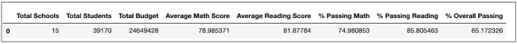
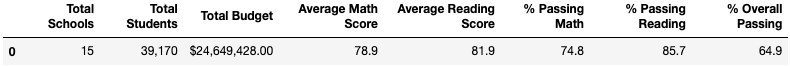
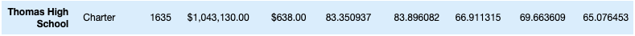
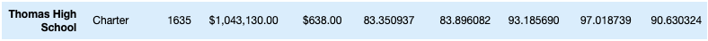
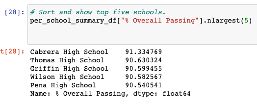
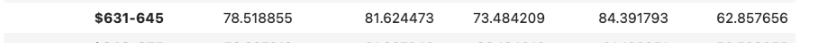

# school_district_analysis

## Overview of the school district analysis: Explain the purpose of this analysis.
The school board that asked us to run our initial analysis on the school district has found evidence of academic dishonesty. We have been tasked with re-doing our analysis, adjusting our data for the altered scores. We make sure to adjust the grade averages for reading and math as well as the overall averages. From here we re-ran our analysis summery for each grade, school district and school type. 

## Results: Using bulleted lists and images of DataFrames as support, address the following questions.

 **How is the district summary affected?**
  The district summary saw an increase in reading scores and passing percentage but a decrease in math scores, math passing percentage and overall passign percentage.
 
 
 **How is the school summary affected?**
  When it comes to the average math and average reading scores, there was no noticeable change. However, the percentage of passing math scores did increase form ~74.8% to ~75.0% and the percentage of passing reading scores increased from ~85.7% to ~85.8%. The most significant change came in the overall passing percentage, which increased from ~64.9% to ~65.2%.

  **How does replacing the ninth graders’ math and reading scores affect Thomas High School’s performance relative to the other schools?**
  After dropping the ninth graders' math and reading scores, Thomas High School's performance sky-rocketed compared to the other schools. 
  

  **How does replacing the ninth-grade scores affect the following:**
   **Math and reading scores by grade** - since this is grouped by school and grade, there was not much that was affected by the adjusted data. 
    **Scores by school spending** - Scores by school spending had a slight uptick in it's average reading scores but had a drop in everything else.
    **Scores by school size** - Scores by school size had a slight uptick in all categories (average scores, percentages and overall).
    **Scores by school type** - Scores by school type had a slight uptick in all categories (average scores, percentages and overall).

## Summary: Summarize four changes in the updated school district analysis after reading and math scores for the ninth grade at Thomas High School have been replaced with NaNs.

Thomas High School performace relative to other schools:
You can see in the photos bellow how much the score changed. The original passing percentage for math was 66.9% and the adjusted percentage after dropping the ninth graders' scores became 93.2%. Also, the original passing percentage for reading scores was 69.7% and the adjusted percentage after dropping the ninth graders' scores became 97.0%. The overall percentage increased to 90.6% from a meager 65.0%. 

 
 
 
 Thomas High Schools adjusted passing percentage brought it into the top 5 out of all the schools in the district - finishing in second place.
 

Scores by school spending:
Thomas High School fell under the $631-645 category for school spending. Comparing the two photos below you can see that the original average reading score was 81.62 and the new average reading score became 81.63. However, the overall passing percentage decreases from 62.85% to 62.78% and the % passing reading drops from 84.39% to 84.32%.

